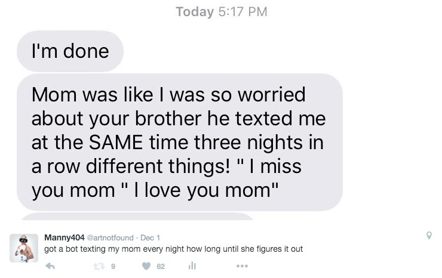

  

# mom-texter

Script that pulls a random line of text from a `.txt` file and texts it to a buddy on your iMessage list, for example, your mom.

## Usage

Target user MUST be a 'buddy' of yours on iMessage. iMessage is awful tbh and I still don't know what a buddy is but I think if you've messaged them once they're definitely your buddy. 

then simply run 
`osascript texter.applescript [path/to/your/texter.applescript] [target phone #] [path/to/your/messages.txt]`

eg: `osascript texter.applescript ~/mom-texter/texter.applescript 17864591200 ~/mom-texter/messages.txt`

## Automation

`cron.txt` includes a cronjob that runs the script every night randomly from 9-11pm and instructions on how to set up a cronjob if needed. 
